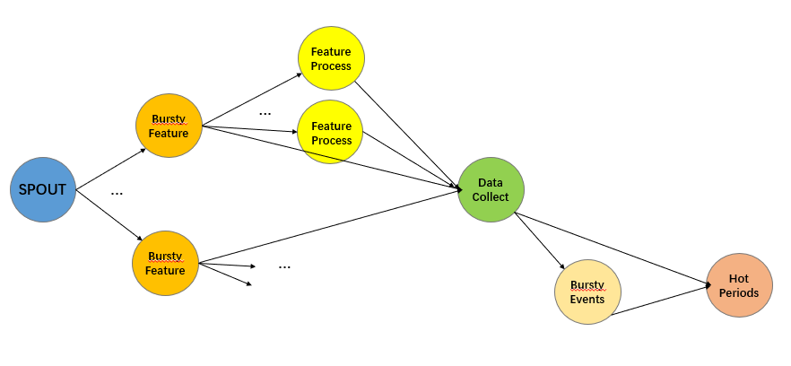
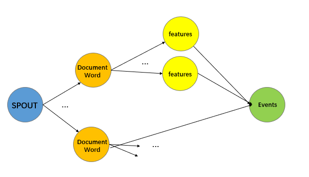
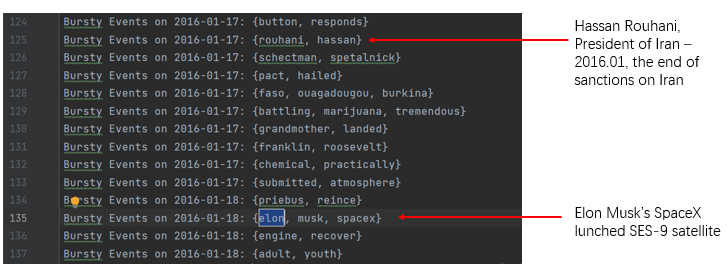
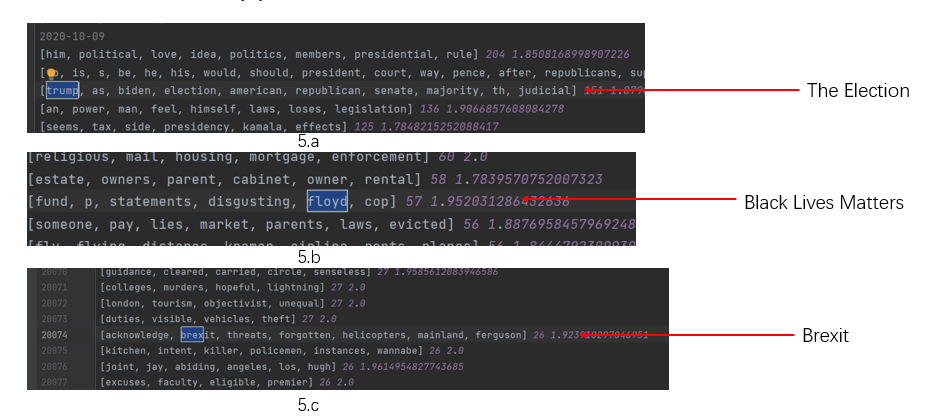

# Bursty Event Detetion

项目组成员：傅尔正 李屹 韩晓宇 赵予珩

项目选题为基于 Storm/Flink 的文本流事件监测，项目实现主要参照 **VLDB‘05** 论文 [*Parameter Free Bursty Events Detection in Text Streams*](files/VLDB05_Parameter.pdf)。本项目基于 Storm 和 Kaggle 上的新闻数据集完成了 Bursty Event Detetion 的两种实现算法，其一是传统的基于参考文献实现的算法，其二是项目成员根据原有算法进行针对性优化后的改进算法。

本报告分为以下五个部分进行撰写：环境搭建与数据清洗、基于参考文献的算法实现、改进算法及修改思路、事件检测结果、事件检测准确性对比分析以及项目分工。


## 环境搭建与数据清洗

### 环境搭建

在本次项目中，我们需要借助Storm来进行文本流事件监测，因此我们首先需要进行环境的搭建。 环境搭建部分首先参考了[从零搭建Hadoop+Zookeeper+HBase完全分布式集群](https://www.jianshu.com/p/dc2913a07770)攻略在老师提供的五台服务器中的三台上搭建了Hadoop分布式集群，接着又参考了[Storm安装教程](https://www.jianshu.com/p/51cbd41abc1e)，在这些机器上安装了Storm，整体搭建过程中基本没有遇到太多棘手的问题。不过唯一需要注意的是，三台服务器上的时间并不同步，导致无法正常启动某些服务，由于服务器没有联网，因此我们选择手动使用`date -s`命令进行了大致的时间同步（服务允许不同机器上存在一定范围内的时间差），同步后分布式集群即可正常使用。

### 数据获取

由于我们组所做的工作是文本流事件监测，因此我们需要的数据就是带有具体日期的新闻文本数据。最初我们在 kaggle 上找到了 [All the news](https://www.kaggle.com/snapcrack/all-the-news) 新闻数据集，进行了处理并选取了其中时间为 2016 年的新闻，但由于这个数据集比较小，处理出来的数据大约只有 300M 左右，满足不了我们的需求，因此我们后续又找到了 [New York Times Articles & Comments (2020)](https://www.kaggle.com/benjaminawd/new-york-times-articles-comments-2020) 新闻数据集，最终处理出来约 1.8G 的数据供本次项目使用。

### 数据处理

由于我们找到的新闻数据集是 kaggle 上已经基本处理好的数据集，因此我们只需要简单处理得到我们想要的东西即可。原数据集中包含了许多我们用不到的无关项，比如标题，作者，分类等，因此在处理的时候，我们只需要保留一列时间栏，用于记录一条新闻的日期，格式为 xxxx-xx-xx ，另一列为新闻栏，用于记录新闻的主要内容即可。对于新闻正文，由于我们的任务是文本流事件监测，且新闻数据本身语言为英文，因此我们需要对新闻正文进行一些简单的处理，主要工作就是仅保留新闻文本中的英文字符，删除其它的无关字符，同时删除多个连续的空格，并将所有的英文字符均替换为小写字符即可。最后在处理完文本后，将我们需要的内容以`Date\tText\n`的形式输出到`news.txt`文件中，Storm输入数据即准备就绪。


## 基于参考文献的算法实现

这部分算法基于参考文献实现，主要结构和算法保持不变，但因从批处理改成流处理，仍有部分实现有修改（如用滑动窗口中的数据代替历史数据）。

### 代码结构

```cmd
BurstyEventsDetection
│   BurstyEventsBolt.java
│   BurstyEventsDetectionTopology.java
│   BurstyFeaturesBolt.java
│   DataCollectBolt.java
│   FeatureProcessBolt.java
│   HotPeriodBolt.java
│   NewsSpout.java
│
├───lib
│       Binomial.java
│       BurstyProb.java
│       Calc.java
│       UnionFind.java
│
└───module
        Document.java
        Event.java
        Feature.java
        FeatureInfo.java
```
#### Storm Topology

如下，Storm Topology的结构定义在`BurstyEventsDetectionTopology.java`，共有1个Spout和5个Bolts.



[`NewsSpout.java`] 模拟了数据的流输入，从文件读入并定时打包发送时间戳相同的数据

[`BurstyFeaturesBolt.java`] 将每天的feature的文档信息写成一个内部静态类`FeatureInfo.Info`，并按fieldsGrouping发送到下一个bolt

[`FeatureProcessBolt.java`] 原理为滑动窗口的cache缓存了了`expire_day`天的数据，同一feature合并成一个`FeatureInfo`打包发送下游

[`DataCollect.java` ]将上一步并行计算的`FeatureInfo`进行打包（进行了同步化操作）

[`BurstyEventsBolt.java`] 将整天的features进行聚类，设数量为n，原文的方法复杂度为O(2<sup>n</sup> * n)，这里修改为贪心连边，复杂度降为O(n<sup>3</sup>)。同时，在这里进行了feature的筛选，滤掉了出现平均频率过高（Stopwords）和过低（非Bursty)。向下游发送Event集合

[`HotPeriodBolt.java`] 跟拒Event和Doc数据计算Event在当下突发的概率并输出结果  

```java
builder.setSpout("News", new NewsSpout(), 1);
builder.setBolt("BurstyFeatures", new BurstyFeaturesBolt(), 5)
        .shuffleGrouping("News");
builder.setBolt("FeatureProcess", new FeatureProcessBolt(), 10)
        .fieldsGrouping("BurstyFeatures", new Fields("feature"));
builder.setBolt("DataCollect", new DataCollectBolt(), 1)
        .globalGrouping("BurstyFeatures", "FeatureCount")
        .globalGrouping("FeatureProcess");
builder.setBolt("BurstyEvents", new BurstyEventsBolt(), 1)
        .globalGrouping("DataCollect");
builder.setBolt("HotPeriod", new HotPeriodBolt(), 1)
        .globalGrouping("BurstyEvents")
        .globalGrouping("DataCollect");
```

除了以上主要部分，还包含以下依赖文件：

#### lib

[`Binomial.java`] 计算二项分布概率

[`BurstyProb.java`] 计算feature突发概率

[`Calc.java`] 计算数组平均值和方差

[`UnionFind.java`] 并查集

#### module

[`Document.java`, `Event.java`, `Feature.java`, `FeatureInfo.java`] 定义了结构中用到的四个类。

### 实现的问题

#### 冷启动

据观察，原文给的算法在数据量极小的时候会将所有feature都判为bursty，即冷启动问题，这里的解决方案是丢弃前7天的运行结果。

#### 并行问题

由于原文给出算法均基于批处理，改为流处理的实现方法中亦无太多可并行计算之处，仅在`FeatureProcess`一处根据feature字段进行并行处理，但造成了之后数据同步问题，额外增加了处理成本，故此计算逻辑不适合Storm/Flink这类的流框架。

#### 内存问题

原文算法需要实时依靠历史信息，在流计算中显然是无法做到不断增加存储的，故在各个bolts基于滑动窗口实现了cache一定期限的信息的功能，使能访问到一定时间段的历史信息。

#### 数据合规性检查

这版实现没有进行数据合规性检查，输入错误格式数据可能会造成多个板块崩溃，只能靠重启解决，这样又会带来一次冷启动。


## 改进算法及修改思路

### 原算法的问题

- 需要存储每个词在过去一个月内出现的文档集合，存储开销大。对于一些高频词，要维护的文档ID会超过十万。

- 需要将上述文档集合与词一起传输，tuple体积过大，不利于处理。

- 需要计算集合的交和并，直接计算效率低。

- 原先的cost函数与词频密切相关，难以发现高频词和低频词之间的联系：

  设两个词A、B的出现文档数为$D_1$、$D_2$，共同出现文档数为$D$，不妨设$D_1\geq D_2$，暂不考虑历史数据项。

  在两个词分开时，公式中的概率项$P=1-\frac{D_2}{D_1}$；

  在两个词聚合时，公式中的概率项$P=\frac{D_1 D_2}{(D_1+D_2-D)^2}$.

  容易看出，在$D_1>>D_2$时，即使$D=D_2$，即B词全部与A词同时出现，算法仍会令A、B分开；

  反过来，若$D_1=D_2$，即使$D=0$，即两词从未同时出现，算法仍会令A、B聚合。

- 原算法在计算时需要遍历所有$E_k$，这是NP的，在实现原算法时直接改用了贪心算法如下

  * 初始化事件列表$E=\emptyset$
  * 取当前尚未被聚类的feature中出现次数最多的，记为$f$。考虑$E$中的所有事件$E_k$，求得所有$E_k+\{f\}$中最小的cost，再考虑尚未被聚类的feature中与$f$不同的所有$f_i$，求得所有$\{f_i,f\}$中的最小cost。在上面两者中取一个最小的cost，若为前者，若该cost比原先$E_k$的cost更小，则将$f$加入$E_k$，否则丢弃$f$；若为后者，则将$\{f_i,f\}$加入$E$。
  * 重复上一步，直到所有feature都被聚类（丢弃也视作已经聚类）。

### 新算法的设计

[`Document Spout`] - [`Document Word Bolt`] - [`Word Feature Bolt`] - [`Event Output Bolt`]

#### Storm Topology



[`Document Spout`] 读取数据并转化为（ID，文档）tuple

[`Document Word Bolt`] 类似 Wordcount，输出（词，文档ID）tuple

[`Word Feature Bolt`] 采用 fieldgroup，维护每个词的统计数据

[`Event Output Bolt`] 采集一段时间内各个词的统计数据，输出聚合出的事件

- 采用维护窗口内文档集合的`minhash` 来代替维护文档集合本身。`minhash` 采用与数据无关的 hash 函数，从而支持在向集合插入元素时动态更新而不必存储集合内容。这样修改之后，`word feature bold` 对收到的每个（词，文档ID）tuple，只要更新一下它维护的`minhash`，而不用存储文档ID，减小了存储开销，加快了处理速度。

  > `word feature bolt` 维护两个 `minhash`，一个是该词在历史上一共出现的文档集合的 `minhash`，一个是该词在窗口内出现的文档集合的 `minhash`。因为 `word feature bolt` **没有保存集合内容**，难以删除元素实现滑动窗口，此处的窗口采用的是非滑动窗口的实现，每次完成一个窗口内数据的流计算后就将维护的窗口内统计数据清空。

- 处理完一个窗口内的数据后，只需要传输（词，`minhash`）tuple 给 `event output bolt`，传输的 tuple 大小是确定的，减小传输压力。

  > 此处“每完成一个窗口反馈一次”其实不太符合流处理的逻辑。在真实业务场景中，更合适的办法是`word feature bolt` 直接将统计数据写入 hbase/redis 等持久化存储，然后设置一个定时任务读取持久化存储中的数据并输出实时监测到的 event。因为这里的流是用历史数据模拟的，而且我们没法1:1的还原现实时间，因此采用了处理完一个窗口后发送特殊标志，让 `word feature bolt` 将统计数据传送到 `event output bolt` 的变通办法。

- `event output bolt` 采用 `minhash` 近似计算集合的交和并，时间复杂度为常数，计算效率极大提升。

- 重新设计了 event 聚类的办法。取消了原先 cost 函数的设计，改为**若包含$E_k$中所有feature的文档数量较历史显著增长，则认为$E_k$构成event**。其中，“较历史显著增长”的计算规则与 `bursty feature` 的规则基本一致。这一算法对聚合的判定只取决于包含$E_k$中所有 feature 的文档数量，与词频没有直接关联，对高频词和低频词间的聚合更友好。

  >  在原bursty feature判定算法中，用历史上每日词频的平均值而非历史上的总体平均值（总次数/总天数）计算参考词频$p$。为了减小存储历史上每日每词的minhash的开销，前述用 `bursty feature` 的算法计算 `bursty event` 时改用了总体平均值。考虑到原始数据每日的文档数量虽然有出入，但没有特别大的差别，取消正规化对精度的影响不是很严重；同时在提取出 `bursty feature` 后，基本上已经确定当天的热点内容，如果客观上存在显著的 `bursty event`，其 feature 间的聚合倾向应该是非常强的，后面的聚类步骤允许一定的误差。

### 新算法的问题

新算法虽然修改了聚合算法，取得了一些效果，但新的聚合算法仍然存在问题。从结果中不难看出，新算法有一些矫枉过正的现象，容易错误地将低频词与高频词聚合。

一般情况下，高频词应当被判定为 `stop word` 从而不会成为 `bursty feature`。但是实践中发现，除了 a，the，of 等几乎所有文档中都出现的极高频词外，很多高频词，如 he，she，as 出现的频率并没有我们所想的那么高，大概只有0.1~0.2，达不到判定 `stop word` 的阈值（论文中所举的例子为0.8），在这些词确实发生 burst 现象时（如词 he 的出现频率突然达到了0.3），就会被判定为 `bursty feature`。又由于这些高频词的出现频率远高于通常出现频率为$10^{-3}$级别的低频词，有很大概率所有低频词都和高频词同时出现，从而错误地将高频词和任意一个低频词聚合在一起。

作为改进，可以考虑调低 `stop word` 的判定阈值，也许能够改善错误引入高频词的问题。但另一方面来看，高频词的 burst 现象也是客观存在的，如从0.1突然变成0.3，显然可以说明其与某个 `bursty event` 强烈关联，只是我们的算法难以确定其与哪个 `bursty event` 关联而已。


## 事件检测结果

如下图，两种算法都对突发事件有较好的预测能力.






## 事件检测准确性对比分析

事件检测准确性对比分析部分旨在分析两种算法的计算效率和结果准确性。

#### 计算效率

可以直观地从等量的数据处理时间来反映计算效率：实验结果表明，传统的算法数据处理速度约为 2M/s，而改进后的算法数据处理速度达到 7.6M/s, 是传统算法的3.8倍，可以在4分钟内处理约2GB的数据。这与我们的预期基本一致，由于改进的算法采用 `minhash` 用于判断集合相似度，大大提高了运算效率。

#### 结果准确性

对于算法的结果准确性，我们通过两种算法检测出的突发事件相似度来判断。其相似度越高代表两种算法的分析结果越准确，反之如果相似度差异较大则需要进一步判断是哪一种算法的结果准确度较差导致。

针对相同事件的判断，我们考虑通过组成事件的 `features list` 的近似度来表示。经过查阅资料和对比算法，我们选择了 `Jaccard Distance` 作为判断集合相似程度的指标，`Jaccard Distance` 的计算公式和代码如下：
$$
d_j(A, B) = 1 - J(A, B) = 1 - \frac{|A\cap B|}{|A\cup B|} = \frac{|A\cup B| - |A\cap B|}{|A\cup B|}
$$

~~~python
def jaccard(a, b):
    return 1 - float(len(a & b))/len(a | b)
~~~

显然可知，`Jaccard Distance` 越小，代表两个集合近似度越高。由于在两种算法中都对事件进行过依次聚类运算，我们可以对 `Jaccard Distance` 设置较高的阈值 `ALPHA = 0.7`，即当 `Jaccard Distance < ALPHA ` 时我们认为两种算法识别出同一个突发事件。

随机选取 `2016-01-18` 至 `2016-02-08` 这段时间（22个时间窗）的事件检测结果进行对比，发现此结果下两种算法检测到相同事件的占比很小。远低于预期值。对算法处理结果进行进一步分析发现，对于某些事件，虽然传统算法的 `features list` 完全包含改进算法的 `features list`，但由于传统算法产生事件的 `features list` 有较多冗余，导致 `Jaccard Distance` 很大，不能很好识别。进一步从算法设计的角度分析得出传统算法由于在聚类过程中采用了贪心匹配的方式，导致某些高频词匹配到的其余单词数量过多，最终导致事件的 `features list` 过于庞大产生大量冗余。同时这种方法对事件的识别得到的是一种粗粒度的结果，并不够精细。针对该原因我们调整了判断 `features list` 近似度的算法，采用 `Pseudo Jaccard Distance` 来进行判断，代码如下：

~~~python
def pseudo_jaccard(a, b):
    return 1 - max(float(len(a & b))/len(a), float(len(a & b))/len(b))
~~~

新的算法能够较好地避免由于集合过大而产生的偏差，但总的来说，对于一般时间段（无特异性突发事件）的事件检测来说，传统算法依然是粗粒度不够精确的，得到的相同事件依旧较少，数据可视化结果如下图：


由于传统算法对于高频词的聚类会出现过度聚合的情况，我们预测，针对短时间内有突发特异性事件的场景下，算法的预测结果将会更准确。由此我们选取 `2020-10-01` 至 `2020-10-22` 这段时期也就是美国总统大选期间的事件检测结果进行了同样的分析，得到如下结果：


可以看出，与随机事件段相比，在短时间内有突发特异性事件的场景下，两种算法得出的结果相似程度极高。这是由于该时间段内与美国大选相关的特异性词汇集中出现，导致算法聚合的精确度较高。针对两种判断事件相似性的算法分别得到的相同事件占比分别从 6.11% 和 15.00% 上升到 70.50% 和 85.06%。同时，可以从折线图中看出，在10月7日，10月15日以及10月22日左右算法预测结果的精确度都达到了极值，这也能够与以上三日分别进行的副总统大选辩论，总统大选第二、第三轮辩论的日期相对应。针对上述数据结果我们可以认为，算法预测的精确度随着突发事件的特异性程度有明显变化，突发性事件特异性程度越高（比如美国大选，总统大选辩论），算法检测的突发事件越趋近于真实情况。


## 项目分工

傅尔正：基于参考文献实现了其突发事件检测算法

李屹：对前述算法进优化设计改进算法

韩晓宇：环境搭建，数据清洗

赵予珩：基于事件检测结果的算法对比分析，项目汇报，文档撰写